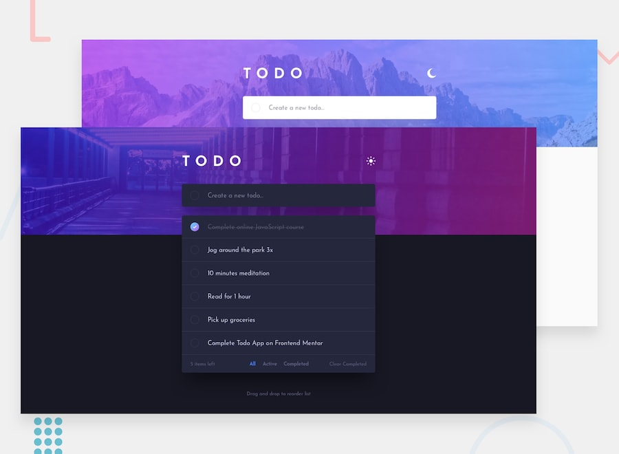

## Frontend Mentor - Todo App Solution

This is a solution to the [Todo app challenge on Frontend Mentor](https://www.frontendmentor.io/challenges/todo-app-Su1_KokOW). Frontend Mentor challenges help you improve your coding skills by building realistic projects.

<p>
  <a href="">
    </a>
  <a href="https://haquanq-frontendmentor.github.io/todo-app/">
    </a>
  <a href="./LICENSE"
    ></a>
</p>

## Table of Contents

- [Project Overview](#sunrise-project-overview)
- [Tech Stack and Approach](#stars-tech-stack-and-approach)
- [Local Development](#leaves-local-development)
- [Deployment](#maple_leaf-deployment)

## :sunrise: Project Overview

### Challenge Requirements

- View the optimal layout for the app depending on their device's screen size
- See hover states for all interactive elements on the page
- Add new todos to the list
- Mark todos as complete
- Delete todos from the list
- Filter by all/active/complete todos
- Clear all completed todos
- Toggle light and dark mode
- **Bonus**: Drag and drop to reorder items on the list

### Status

Features

- [x] Todo component with drag-n-drop/sorting
- [x] Dark/light mode

Accessibility

- [x] Responsive accross different screen sizes
- [x] Interactive elements have clear focus indicator

### Preview



## :stars: Tech Stack and Approach

### Built With

- **HTML5** – Semantic structure
- **Vue** – Fine-grained reactivity state management
- **TailwindCSS** – Utility-first CSS for fast development
- **TypeScript** - Interactivity and application logic
- **Vite** - Fast development server, production build and easy configuration

### Approach

- Mobile-first workflow for better performance on smaller devices
- Accessibility guided by [ARIA Authoring Practices Guide (APG)](https://www.w3.org/WAI/ARIA/apg/)

## :leaves: Local Development

### Prerequisites

Install the following:

- Git (latest version)
- Node.js (latest LTS recommended)
- pnpm (latest version)

### Setup

```
git clone https://github.com/haquanq-frontendmentor/todo-app.git
cd todo-app
pnpm install
```

### Start Development Server

```
pnpm dev
```

## :maple_leaf: Deployment

Deployed to Github Pages via Github Actions (manually trigg
